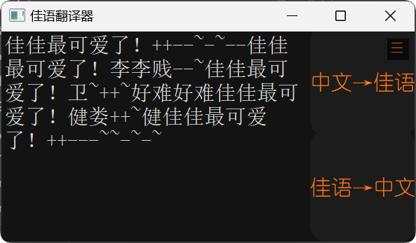
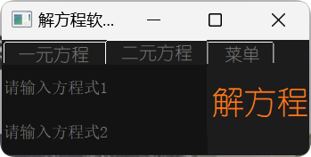
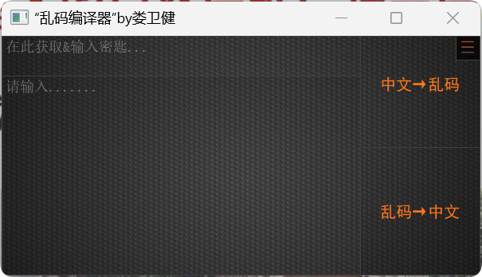
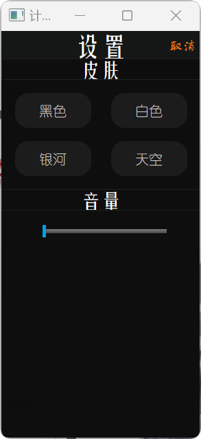
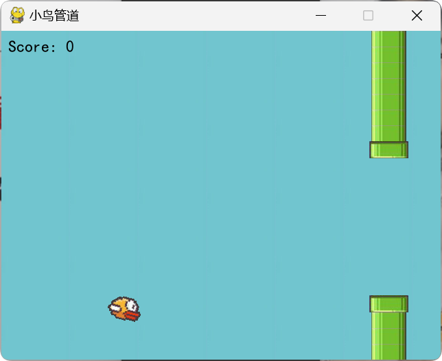
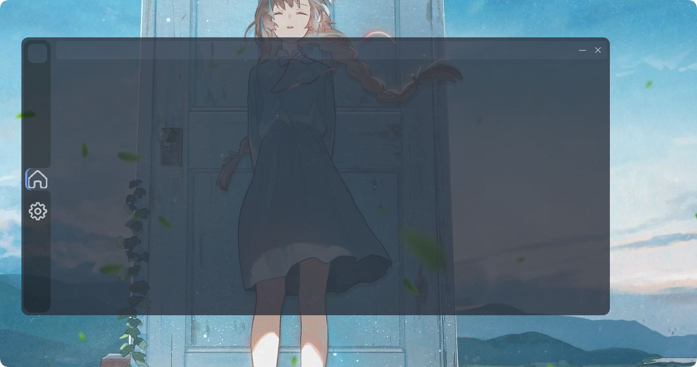

## 开发工具

- 集成开发环境：Pycharm
- Python
- Pyside2

## 功能

1. **计算器**  

包括计算器和科学计算器，科学计算器功能更多，支持键盘输入，有输入音效

2. **佳语翻译器**  

把用户输入的文字转化为意义不明的文字，并且可以通过该软件给还原回来。。。。




3. **解方程**  

不必多言，就是解方程的东西，初中学一元二次方程的时候写了这个软件，用来懒得写求根公式



4. **乱码编译器** 

就是加密，比刚刚那个高级一点，这个对于同一段文字会生成随机的密钥，加强随机性，需要密钥和加密后的文字同时输入才能得到原文字（原理都是基于凯撒密码）



5. **商城（皮肤/设置）**  

当初做了金币系统，可以买皮肤，但是懒得做皮肤了。。。。




6. **小鸟管道**  

前面提到金币系统，那么金币从哪里来呢？就是这个游戏了

其实我本来只是想做一个计算器，后来加的功能越来越多。。。甚至有了游戏，所以干脆改名工具箱了



源码就不放了，想看加我qq


# 后来增加了新的UI界面，但是没有把功能放进去，但是UI还是挺好看的，如图



还可以，但是没有再完善了

**以下为main.py的代码，也有近千行了**  

​    

```
import keyboard                           #qq号：2141703630有兴趣交流哦
from PySide2.QtWidgets import QApplication, QMessageBox
from PySide2.QtUiTools import QUiLoader
import pygame
import math
from sympy import *
from pygame.mixer import *
import time
import json
import Bird
import Pipe
import pygame
from pygame.locals import *
import sys

sys.setrecursionlimit(5000)
lmresulr=''
x = Symbol('x')
y = Symbol('y')#导入
result1 = ''
lfresult=''
pygame.mixer.init()
pygame.mixer.music.load('dazi.mp3')  
pygame.mixer.music.set_volume(1.0)
shuru=''
xianshi='0'
zxianshi='0'
zxianshi2=''
lastwin='win1'
rt=''
pan=''
m=0
WIDTH, HEIGHT = 640, 480
running =False 
from Game6 import main

class Window1:

    def __init__(self):
        self.ui = QUiLoader().load('win1.ui')#动态加载ui
        self.ui.bt1.clicked.connect(lambda:self.cao1("1"))
        self.ui.bt2.clicked.connect(lambda:self.cao1("2"))
        self.ui.bt3.clicked.connect(lambda:self.cao1("3"))
        self.ui.bt4.clicked.connect(lambda:self.cao1("4"))
        self.ui.bt5.clicked.connect(lambda:self.cao1("5"))
        self.ui.bt6.clicked.connect(lambda:self.cao1("6"))
        self.ui.bt7.clicked.connect(lambda:self.cao1("7"))
        self.ui.bt8.clicked.connect(lambda:self.cao1("8"))
        self.ui.bt9.clicked.connect(lambda:self.cao1("9"))
        self.ui.bt0.clicked.connect(lambda:self.cao1("0"))
        self.ui.btdian.clicked.connect(lambda:self.cao7())
        self.ui.btcheng.clicked.connect(lambda:self.cao3("×"))
        self.ui.btchu.clicked.connect(lambda:self.cao6(""))
        self.ui.btjia.clicked.connect(lambda:self.cao3("+"))
        self.ui.btjian.clicked.connect(lambda:self.cao3("-"))
        self.ui.btdeng.clicked.connect(lambda:self.cao2())
        self.ui.bttui.clicked.connect(lambda:self.cao4())
        self.ui.btc.clicked.connect(lambda:self.cao5())
        self.ui.btmenu.clicked.connect(lambda:self.win2())
        self.ui.btyan.clicked.connect(lambda:self.cao8())

        self.ui.xianshi.setText(zxianshi)
        self.maxnum=16
        if __name__ == "__main__":
            keyboard.add_hotkey("1",lambda:self.cao1("1"))
            keyboard.add_hotkey("2",lambda:self.cao1("2"))
            keyboard.add_hotkey("3",lambda:self.cao1("3"))
            keyboard.add_hotkey("4",lambda:self.cao1("4"))
            keyboard.add_hotkey("5",lambda:self.cao1("5"))
            keyboard.add_hotkey("6",lambda:self.cao1("6"))
            keyboard.add_hotkey("7",lambda:self.cao1("7"))
            keyboard.add_hotkey("8",lambda:self.cao1("8"))
            keyboard.add_hotkey("9",lambda:self.cao1("9"))
            keyboard.add_hotkey("0",lambda:self.cao1("0"))
            keyboard.add_hotkey("+",lambda:self.cao3("+"))
            keyboard.add_hotkey("-",lambda:self.cao3("-"))
            keyboard.add_hotkey("*",lambda:self.cao3("×"))
            keyboard.add_hotkey("/",lambda:self.cao6(""))
            keyboard.add_hotkey("backspace",lambda:self.cao4())
            keyboard.add_hotkey("enter",lambda:self.cao2())
            keyboard.add_hotkey("ctrl+backspace",lambda:self.cao5())
        self.ui.xianshi.setText(str(0))
        self.ui.xianshi.setText(zxianshi)
        self.ui.xianshi2.setText(zxianshi2)
    def cao1(self,intt):
        global shuru,xianshi,zxianshi,zxianshi2
        if len(shuru)<=self.maxnum+1:
            if xianshi=="0":
                xianshi=''
            pygame.mixer.music.play()
            pygame.mixer.music.play()
            shuru+=intt
            xianshi+=intt
            zxianshi=xianshi
            zxianshi2=''
            self.ui.xianshi2.setText('')
            self.ui.xianshi.setText(xianshi)
        
    def cao2(self):
        pygame.mixer.music.play()
        pygame.mixer.music.play()
        global shuru,xianshi,zxianshi,zxianshi2,rt
        self.ui.xianshi2.setText(xianshi+"=")
        result=shuru.replace("÷","/")
        result=shuru.replace("×","*")
        rt=str(eval(result))
        self.ui.xianshi.setText(rt)
        zxianshi2=xianshi+'='
        zxianshi=str(eval(result))
        shuru =""
        xianshi="0"
    def cao3(self,intt):
        global shuru,xianshi
        num=len(shuru)
        if  xianshi!="0" or intt=="-":
            if len(shuru)<=self.maxnum:
                if shuru[num-1:] in ["+","-","×","/"]:
                    pygame.mixer.music.play()
                    pygame.mixer.music.play()
                    shuru=shuru[:-1]
                    shuru+=intt
                    xianshi=xianshi[:-1]
                    xianshi+=intt
                    self.ui.xianshi.setText(xianshi)
                else:
                    if xianshi=="0":
                        xianshi=''
                    pygame.mixer.music.play()
                    pygame.mixer.music.play()
                    xianshi+=intt
                    shuru+=intt
                    self.ui.xianshi.setText(xianshi)
  
            
          


            self.ui.xianshi.setText(shuru)
    def cao4(self):
        global shuru,xianshi
        pygame.mixer.music.play()
        pygame.mixer.music.play()
        text=self.ui.xianshi.text()
        if text:
                xianshi=text[:-1]
                shuru=xianshi
        else:
            if xianshi!="0":
                if xianshi!="":
                    shuru=shuru[:-1]
                    xianshi=xianshi[:-1]
                    if xianshi=="":
                        xianshi="0"
            else:
                xianshi=""
        self.ui.xianshi.setText(xianshi)
        

    def cao5(self):
        pygame.mixer.music.play()
        pygame.mixer.music.play()
        global shuru,xianshi
        shuru=''
        xianshi='0'
        xianshi2=""
        zxianshi='0'
        zxianshi2=''
        self.ui.xianshi.setText(xianshi)
        self.ui.xianshi2.setText(xianshi2)
    def cao6(self,chu):


        global shuru,xianshi
        num1=len(shuru) 
        if len(shuru)<=self.maxnum:
            if xianshi!="0":
                pygame.mixer.music.play()
                pygame.mixer.music.play()
                if num1<=self.maxnum:
                    if shuru[num1-1:] in ["+","-","×","/"]:
                        shuru=shuru[:-1]
                        xianshi=shuru
                        xianshi+="÷"
                        shuru+="/"
                        self.ui.xianshi.setText(xianshi)
                    else:
                        xianshi=shuru
                        shuru+="/"
                        xianshi+="÷"
                        self.ui.xianshi.setText(xianshi)
    def cao7(self):
        global shuru,xianshi
        if len(shuru)<=self.maxnum:
            pygame.mixer.music.play()
            pygame.mixer.music.play()
            shuru+="."
            xianshi+="."
            self.ui.xianshi.setText(xianshi)
    def cao8(self):
        pygame.mixer.music.play()
        pygame.mixer.music.play()
        global shuru,xianshi,pan
        
        pan=self.ui.xianshi.text()
        if pan != xianshi:
    
            shuru=pan
        try:
            xianshi=str(math.sqrt(float(shuru)))
        except:
            try:
                xianshi=str(math.sqrt(int(shuru)))
            except:
                print("输入错误")
        rt=xianshi
        xianshi=xianshi[:self.maxnum]
        zxianshi=xianshi
        self.ui.xianshi.setText(xianshi)
        xianshi='0'
    def win2(self):
        self.ui.close()
        self.windowsmenu = Windowmenu()
        self.windowsmenu.ui.show()
        app.exec_()
class Window2(Window1):
    def __init__(self):
        super().__init__()
        self.ui = QUiLoader().load('win2.ui')#动态加载ui
        self.ui.bt1.clicked.connect(lambda:self.cao1("1"))
        self.ui.bt2.clicked.connect(lambda:self.cao1("2"))
        self.ui.bt3.clicked.connect(lambda:self.cao1("3"))
        self.ui.bt4.clicked.connect(lambda:self.cao1("4"))
        self.ui.bt5.clicked.connect(lambda:self.cao1("5"))
        self.ui.bt6.clicked.connect(lambda:self.cao1("6"))
        self.ui.bt7.clicked.connect(lambda:self.cao1("7"))
        self.ui.bt8.clicked.connect(lambda:self.cao1("8"))
        self.ui.bt9.clicked.connect(lambda:self.cao1("9"))
        self.ui.bt0.clicked.connect(lambda:self.cao1("0"))
        self.ui.btdian.clicked.connect(lambda:self.cao7())
        self.ui.btcheng.clicked.connect(lambda:self.cao3("×"))
        self.ui.btchu.clicked.connect(lambda:self.cao6(""))
        self.ui.btjia.clicked.connect(lambda:self.cao3("+"))
        self.ui.btjian.clicked.connect(lambda:self.cao3("-"))
        self.ui.btdeng.clicked.connect(lambda:self.cao2())
        self.ui.bttui.clicked.connect(lambda:self.cao4())
        self.ui.btc.clicked.connect(lambda:self.cao5())
        self.ui.btmenu.clicked.connect(lambda:self.win2())
        self.ui.btyan.clicked.connect(lambda:self.cao8())
        self.ui.btz.clicked.connect(lambda:self.cao1("("))
        self.ui.bty.clicked.connect(lambda:self.cao1(")"))
        self.ui.btsin.clicked.connect(lambda:self.sin())
        self.ui.btcos.clicked.connect(lambda:self.cos())
        self.ui.bttan.clicked.connect(lambda:self.tan())
        self.ui.btans.clicked.connect(lambda:self.ans())
        self.ui.btjue.clicked.connect(lambda:self.jue())
        self.ui.btping.clicked.connect(lambda:self.ping())
        self.ui.btsan.clicked.connect(lambda:self.san())
        self.ui.btshu.clicked.connect(lambda:self.cha(shuru))
        self.ui.btxian.clicked.connect(lambda:self.cha(xianshi))
        self.ui.btrt.clicked.connect(lambda:self.cha(rt))
        self.ui.btpan.clicked.connect(lambda:self.cha(pan))
        self.ui.btjie.clicked.connect(lambda:self.jiecheng())
        self.ui.btm1.clicked.connect(lambda:self.m1())
        self.ui.btm2.clicked.connect(lambda:self.m2())
        self.ui.btm3.clicked.connect(lambda:self.m3())
        self.ui.btm4.clicked.connect(lambda:self.m4())
        self.ui.bts.clicked.connect(lambda:self.come_win4())
        
        self.ui.xianshi.setText(zxianshi)
        self.maxnum=27

    def cha(self,intt):
        print(intt)

    def sin(self):
        pygame.mixer.music.play()
        pygame.mixer.music.play()
        global shuru,xianshi,rt,pan
        try:
            pan=self.ui.xianshi.text()
            if pan != xianshi:
                shuru=pan
            rt=str(math.sin(math.radians(int(shuru))))
            xianshi=rt
            xianshi=xianshi[:self.maxnum]
            zxianshi=xianshi
            self.ui.xianshi.setText(xianshi)
            xianshi='0'
        except:
            print("出bug了，但是我懒得修")
    def cos(self):
        pygame.mixer.music.play()
        pygame.mixer.music.play()
        global shuru,xianshi,rt,pan
        try:
            pan=self.ui.xianshi.text()
            if pan != xianshi:
                shuru=pan
            rt=str(math.cos(math.radians(int(shuru))))
            xianshi=rt
            xianshi=xianshi[:self.maxnum]
            zxianshi=xianshi
            self.ui.xianshi.setText(xianshi)
            xianshi='0'
        except:
            print("出bug了，但是我懒得修")
    def tan(self):
        pygame.mixer.music.play()
        pygame.mixer.music.play()
        global shuru,xianshi,pan
        try:
            pan=self.ui.xianshi.text()
            if pan != xianshi:
                shuru=pan
            rt=str(math.tan(math.radians(int(shuru))))
            xianshi=rt
            xianshi=xianshi[:self.maxnum]
            zxianshi=xianshi
            self.ui.xianshi.setText(xianshi)
            xianshi='0'
        except:
            print("出bug了，但是我懒得修")
    def ans(self):
        pygame.mixer.music.play()
        pygame.mixer.music.play()
        global xianshi,shuru,rt
        if xianshi=='0':
            xianshi=''
        xianshi+=rt
        shuru+=rt
        self.ui.xianshi.setText(xianshi)
    def jue(self):
        pygame.mixer.music.play()
        pygame.mixer.music.play()
        global xianshi,shuru,rt,pan
        try:
            pan=self.ui.xianshi.text()
            if pan != xianshi:
                shuru=pan
            if int(shuru) >=0:
                xianshi=shuru
            else:
                xianshi=int(shuru)-int(shuru)*2
            rt=xianshi
            self.ui.xianshi.setText(str(xianshi))
        except:
            print("输入错误")
    def ping(self):
        pygame.mixer.music.play()
        pygame.mixer.music.play()
        global xianshi,shuru,rt,pan
        pan=self.ui.xianshi.text()
        if pan != xianshi:
            shuru=pan
        try:
            xianshi= float(shuru)**2
        except:
            try:
                xianshi= int(shuru)**2
            except:
                print("输入错误")
            
        shuru=''
        rt=str(xianshi)
        self.ui.xianshi.setText(str(xianshi))
        xianshi='0'

    def san(self):
        pygame.mixer.music.play()
        pygame.mixer.music.play()
        global xianshi,shuru,rt,pan
        pan=self.ui.xianshi.text()
        if pan != xianshi:
            shuru=pan
        try:
            xianshi= int(shuru)**3
        except:
            try:
                xianshi= float(shuru)**3
            except:
                print("输入错误")
            
            
        rt=str(xianshi)
        self.ui.xianshi.setText(str(xianshi))
        xianshi='0'

    def jiecheng(self):
        global xianshi,shuru,rt,rslt
        pygame.mixer.music.play()
        pygame.mixer.music.play()
        pan=self.ui.xianshi.text()
        if pan != xianshi:
            xianshi=pan
        try:
            a=int(shuru)
            num=1
            if a < 0:
                print("负数没有阶乘")
                num="无"
            elif a == 0:
                print("0的阶乘为1")
                num=1
            else:
                for i in range(1,a+1):
                    num*=i
            xianshi=num
            rt=str(xianshi)
            zxianshi=xianshi
            self.ui.xianshi.setText(str(xianshi))
                
        except:
                print("输入错误")
    def m1(self):
        pygame.mixer.music.play()
        pygame.mixer.music.play()
        global xianshi,shuru,zxianshi,m
        try:
            m+=int(xianshi)
        except:
            print("输入错误")
    def m2(self):
        pygame.mixer.music.play()
        pygame.mixer.music.play()
        global xianshi,shuru,zxianshi,m
        try:
            m-=int(xianshi)
        except:
            print("输入错误")
    def m3(self):
        pygame.mixer.music.play()
        pygame.mixer.music.play()
        global xianshi,shuru,zxianshi,m
        try:
            if xianshi !='0':
                xianshi+=str(m)
                zxianshi=xianshi
                shuru+=str(m)
            else:
                xianshi=str(m)
        except:
            print("输入错误")
        self.ui.xianshi.setText(xianshi)
    def m4(self):
        pygame.mixer.music.play()
        pygame.mixer.music.play()
        global xianshi,shuru,zxianshi,m
        m=0
    def come_win4(self):
        
        global lastwin
        lastwin = 'win4'
        self.ui.close()
        windows4 = Window4()
        windows4.ui.show()
        app.exec_()
        牛逼666

class Window3:
    def __init__(self):
        self.ui = QUiLoader().load('win3.ui')
        self.ui.button.clicked.connect(self.cao1)
        self.ui.button2.clicked.connect(self.cao2)#动态加载ui
        self.ui.btmenu.clicked.connect(lambda:self.winmenu())

    def cao1(self):
        un = self.ui.textEdit.toPlainText()
        un=un.encode('unicode_escape')
        un=str(un)
        un=un[2:]

        un=un.replace('0','好难')
        un=un.replace('1','+')
        un=un.replace('2','贱')
        un=un.replace('3','娄')
        un=un.replace('4','卫~')
        un=un.replace('5','健')
        un=un.replace('6','李')
        un=un.replace('7','亦~')
        un=un.replace('8','++')
        un=un.replace('9','--')
        un=un.replace('a','+++')
        un=un.replace('b','---~~')
        un=un.replace('c','+~')
        un=un.replace('d','-~')
        un=un.replace('e','++~')
        un=un.replace('f','--~')
        un=un.replace('g','+++~')
        un=un.replace('h','---~')
        un=un.replace('i','佳佳~')
        un=un.replace('j','健健~')
        un=un.replace('k','python')
        un=un.replace('l','亦佳')
        un=un.replace('m','亦佳~')
        un=un.replace('n','卫健')
        un=un.replace('o','卫健~')
        un=un.replace('p','嘎~')
        un=un.replace('q','嘎')
        un=un.replace('r','牛逼')
        un=un.replace('s','666')
        un=un.replace('t','可以的')
        un=un.replace('u','最可爱了！')
        un=un.replace('v','奥利给!')
        un=un.replace('w','吃')
        un=un.replace('x','哎')
        un=un.replace('y','编')
        un=un.replace('z','了')
        un=un.replace('\\','佳')
        n=len(un)
        n-=1
        self.ui.textEdit.setPlainText(un[0:n])

    def cao2(self):
        un = self.ui.textEdit.toPlainText()
        
        un=un.replace('---~~','b')
        un=un.replace('卫健~','o')
        un=un.replace('卫健','n')
        un=un.replace('亦佳~','m')
        un=un.replace('亦佳','l')
        un=un.replace('python','k')
        un=un.replace('健健~','j')
        un=un.replace('佳佳~','i')
        un=un.replace('---~','h')
        un=un.replace('+++~','g')
        un=un.replace('--~','f')
        un=un.replace('++~','e')
        un=un.replace('-~','d')
        un=un.replace('+~','c')

        un=un.replace('+++','a')
        un=un.replace('--','9')
        un=un.replace('++','8')
        un=un.replace('亦~','7')
        un=un.replace('李','6')
        un=un.replace('健','5')
        un=un.replace('卫~','4')
        un=un.replace('娄','3')
        un=un.replace('贱','2')
        un=un.replace('+','1')
        un=un.replace('好难','0')
        un=un.replace('佳','\\')


        un=un.replace('嘎~','p')
        un=un.replace('嘎','q')
        un=un.replace('牛逼','r')
        un=un.replace('666','s')
        un=un.replace('可以的','t')
        un=un.replace('最可爱了！','u')
        un=un.replace('奥利给！','v')
        un=un.replace('吃','w')
        un=un.replace('哎','x')
        un=un.replace('编','y')
        un=un.replace('了','z')
        un.encode('latin-1').decode('unicode_escape')
        un=un.encode('utf8').decode('unicode_escape')
        jiance=un.encode('utf8').decode('unicode_escape')
        self.ui.textEdit.setPlainText(un.encode('utf8').decode('unicode_escape'))
    def winmenu(self):
        self.ui.close()
        self.windowsmenu = Windowmenu()
        self.windowsmenu.ui.show()
        app.exec_()
class Window4:

    def __init__(self):
        self.ui = QUiLoader().load('win4.ui')
        self.ui.button.clicked.connect(self.handleCalc)#动态加载ui
        self.ui.button_2.clicked.connect(self.handleCalc)#动态加载ui
        self.ui.btmenu.clicked.connect(self.winmenu)#动态加载ui

    def handleCalc(self):
        global result1
        fangcheng1 = self.ui.lineEdit.text()
        fangcheng2 = self.ui.lineEdit_1.text()
        fangcheng3 = self.ui.lineEdit_2.text()
        if 'x' in fangcheng1 and "=" in fangcheng1:
            fangcheng1=fangcheng1.replace('=','-')
                
            result1=''
            for i , f in enumerate(fangcheng1):
                if f in ['x', 'y', '(']and i > 0:
                    if fangcheng1[i - 1] not in ['*', '(', '+', '-', '/']:
                        result1 += '*'
                result1 += f
                
                
            QMessageBox.about(self.ui,'解方程结果',"方程的解为:\n"+str(solve([result1], [x]))+"     ")
            self.ui.lineEdit.clear()#清空输入框

        elif 'x' in fangcheng2 and "=" in fangcheng2 and 'y' in fangcheng3 and "=" in fangcheng3:
            fangcheng2=fangcheng2.replace('=','-')
            fangcheng3=fangcheng3.replace('=','-')
            QMessageBox.about(self.ui,'解方程结果',"方程的解为:\n"+str(solve([fangcheng2,fangcheng3], [x,y]))+"     ")
            self.ui.lineEdit_1.clear()#清空输入框
            self.ui.lineEdit_2.clear()#清空输入框

        else:
            QMessageBox.about(self.ui,'温馨提示',"请输入正确的方程   ",)
    def winmenu(self):
        self.ui.close()
        self.windowsmenu = Windowmenu()
        self.windowsmenu.ui.show()
        app.exec_()
class Window5:

    def __init__(self):
        self.ui = QUiLoader().load('win5.ui')
        self.ui.button.clicked.connect(self.cao1)
        self.ui.button2.clicked.connect(self.cao2)#动态加载ui
        self.ui.btmenu.clicked.connect(lambda:self.win2())
    def cao1(self):
        un = self.ui.textEdit.toPlainText()
        un=un.encode('unicode_escape')
        un=str(un)
        un=un[2:]
        un=un[:-1]
        mishi=''
        global lmresulr
        lmresulr=''
        
        
        for i  , f in enumerate(un):
            if f in ["1","2","3","4","5","6","7","8","9","0"]:
                mishi+=f
        l=len(mishi)
        if l >= 10 :
            b=int(l/2)
            s=int(l/-2)
            baoliu=random.randint(0,b-2)
            baoliu2=random.randint(s-2,-1)
            mishi=mishi[baoliu:]
            mishi=mishi[:baoliu2]

            
        mishi2=random.randint(1,9)
        mishi+=str(mishi2)
        for i  , f in enumerate(un):
            if f in ["1","2","3","4","5","6","7","8","9","0"]:
                f=int(f)+mishi2
                f=str(f)
                f=f[-1:]
            else:
                f=f
            lmresulr+=f
 

        lmresulr.encode('latin-1').decode('unicode_escape')
        lmresulr=lmresulr.encode('utf8').decode('unicode_escape')
        lmresulr=lmresulr.encode('utf8').decode('unicode_escape')
        self.ui.textEdit.setPlainText(lmresulr)
        self.ui.mishi2.setPlainText(mishi)
        mishi=''
    def cao2(self):
        un = self.ui.textEdit.toPlainText()
        un=un.encode('unicode_escape')
        un=str(un)
        un=un[2:]
        un=un[:-1]
        密匙=self.ui.mishi2.toPlainText()
        mishi2=int(密匙[-1:])
        if 密匙:
            mishi1=''
            
            global lmresulr
            lmresulr=''
            for i  , f in enumerate(un):
                if f in ["1","2","3","4","5","6","7","8","9","0"]:
                    f =int(f) - mishi2
                    if f < 0:
                        f =f+ 10

                lmresulr+=str(f)
            for i  , f in enumerate(lmresulr):
                if f in ["1","2","3","4","5","6","7","8","9","0"]:
                    mishi1+=f

            if len(str(mishi1))>10:
                l=len(mishi1)
                mishi1=mishi1[:int(l/-2-2)]
                mishi1=mishi1[int(l/2+2):]
            
            if mishi1 in 密匙[:-1]:
                           
                lmresulr.encode('latin-1').decode('unicode_escape')
                lmresulr=lmresulr.encode('utf8').decode('unicode_escape')
                lmresulr=lmresulr.encode('utf8').decode('unicode_escape')
                self.ui.textEdit.setPlainText(lmresulr)
                self.ui.mishi2.setPlainText("")
            else:
                QMessageBox.about(self.ui,'解方程结果',"密匙错误")

        else:
            QMessageBox.about(self.ui,'解方程结果',"请输入密匙    ")
    def win2(self):
        self.ui.close()
        windowsmenu = Windowmenu()
        windowsmenu.ui.show()
        app.exec_()
from pynput.keyboard import Key
from pynput.keyboard import Controller as Kb
import keyboard  
kb=Kb()
class Window6:
    def __init__(self):
        self.ui = QUiLoader().load('win6.ui')#动态加载ui
        self.ui.btstart.clicked.connect(lambda:self.send_message())
        keyboard.add_hotkey("f5",lambda:self.send_message())
        self.ui.btmenu.clicked.connect(lambda:self.win2())
    def send_message(self):
        jiange=self.ui.spj.value()
        number=self.ui.spn.value()
        string=self.ui.neirong.toPlainText()
        time.sleep(4)
        for i in range(0,number):
            kb.type(string)
            time.sleep(jiange)
            kb.press(Key.enter)
            kb.release(Key.enter)
    def win2(self):
        self.ui.close()
        self.windowsmenu = Windowmenu()
        self.windowsmenu.ui.show()
        app.exec_()
class Windowshop:
    def __init__(self):
        self.ui = QUiLoader().load('shop.ui')#动态加载ui
        
        self.ui.btq.clicked.connect(lambda:self.win2())
        self.ui.pifubai.clicked.connect(lambda:self.shopping(1,10))
        self.ui.pifuyin.clicked.connect(lambda:self.shopping(2,10))
        self.ui.pifutian.clicked.connect(lambda:self.shopping(3,10))
        
        with open('settings.json') as f:
            sett =json.load(f)
        self.ui.jinbi.setText(str(sett))
        
        
    def shopping(self,w,j):
        with open('skin.json',) as f:
            sta=json.load(f)
        if sta[w]=="Flase":
            jinbi=self.ui.jinbi.text()
            if int(jinbi) >= j:
                jinbi=str((int(jinbi)-j))
                with open('settings.json', 'w') as f:
                    json.dump(jinbi,f)
                with open('skin.json',) as f:
                    asd=json.load(f)
                asd[w]='True'
                with open('skin.json','w') as ad:

                    json.dump(asd,ad)
                QMessageBox.about(self.ui,'温馨提示',"购买成功！   ")

            else:
                QMessageBox.about(self.ui,'温馨提示',"您的金币不足哦   ")
            self.ui.jinbi.setText(str(jinbi))
        else:
            QMessageBox.about(self.ui,'温馨提示',"您已拥有此皮肤，无需重复购买   ")
            
            
        
        

    def win2(self):
        self.ui.close()
        self.windowsmenu = Windowmenu()
        self.windowsmenu.ui.show()
        app.exec_()

class Windowsettings:
    def __init__(self):
        self.ui = QUiLoader().load('settings.ui')#动态加载ui
        self.ui.btq.clicked.connect(lambda:self.win2())
    def win2(self):
        self.ui.close()
        windowsmenu = Windowmenu()
        windowsmenu.ui.show()
        app.exec_()
        

class Windowmenu:
    def __init__(self):
        self.ui = QUiLoader().load('menu.ui')#动态加载ui
        self.ui.btq.clicked.connect(lambda:self.come_lastwin())
        self.ui.btjisuanqi.clicked.connect(lambda:self.come_win1())
        self.ui.btgj.clicked.connect(lambda:self.come_win2())
        self.ui.btjyfyq.clicked.connect(lambda:self.come_win3())
        self.ui.btslove.clicked.connect(lambda:self.come_win4())
        self.ui.btluanma.clicked.connect(lambda:self.come_win5())
        self.ui.btsetting.clicked.connect(lambda:self.come_settings())
        self.ui.bts.clicked.connect(lambda:self.come_win6())
        self.ui.btshop.clicked.connect(lambda:self.come_shop())
        self.ui.btn.clicked.connect(lambda:self.come_xngd())

    def come_win1(self):
        global lastwin
        lastwin='win1'
        self.ui.close()
        windows1 = Window1()
        windows1.ui.show()
    def come_win2(self):
        global lastwin
        lastwin='win2'
        self.ui.close()
        windows2 = Window2()
        windows2.ui.show()
    def come_win3(self):
        global lastwin
        lastwin = 'win3'
        self.ui.close()
        windows3 = Window3()
        windows3.ui.show()

        
    def come_win4(self):
        
        global lastwin
        lastwin = 'win4'
        self.ui.close()
        windows4 = Window4()
        windows4.ui.show()
        牛逼666
    def come_win5(self):
        
        global lastwin
        lastwin = 'win5'
        self.ui.close()
        windows5= Window5()
        windows5.ui.show()
        牛逼666
 
    def come_win6(self):
        
        global lastwin
        lastwin = 'win6'
        self.ui.close()
        windows6= Window6()
        windows6.ui.show()


    def come_settings(self):
        global lastwin
        lastwin='settings'
        self.ui.close()
        windowssettings=Windowsettings()
        windowssettings.ui.show()
    def come_shop(self):
        global lastwin
        self.ui.close()
        lastwin='shop'
        windowsshop=Windowshop()
        windowsshop.ui.show()
    def come_xngd(self):
        QMessageBox.about(self.ui,'温馨提示',"10分数=1金币\n程序有点bug，关闭游戏会卡死，请关闭程序,金币会加的.    ")
        a=main()
        b=int(a/10)
        with open('settings.json') as f:
            sett =json.load(f)
        jinbi=b+int(sett)
        with open('settings.json', 'w') as f:
            json.dump(str(jinbi),f)
        


    def come_lastwin(self):
        if lastwin=='win1':
            self.come_win1()
        elif lastwin=='win2':
            self.come_win2()
        elif lastwin=='win3':
            self.come_win3()
        elif lastwin=='win4':
            self.come_win4()
        elif lastwin=='win5':
            self.come_win5()
        elif lastwin=='win6':
            self.come_win6()
        elif lastwin=='shop':
            self.come_shop()
        elif lastwin=='settings':
            self.come_settings()


        
if __name__ == "__main__":
    app = QApplication()
    windowsmenu = Windowmenu()
    windowsmenu.ui.show()
    app.exec_()
```


