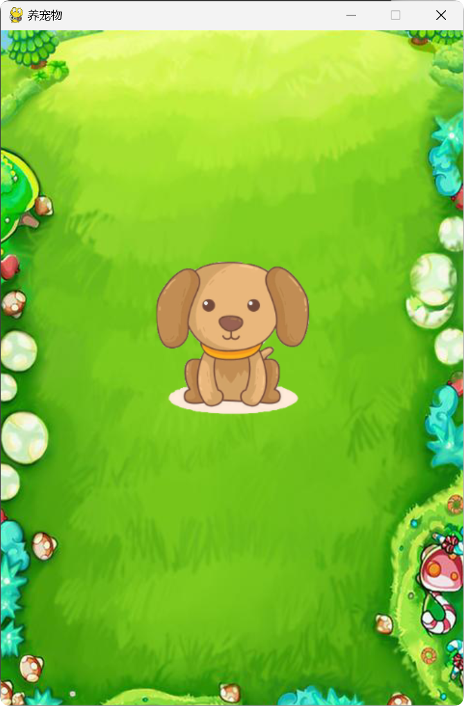
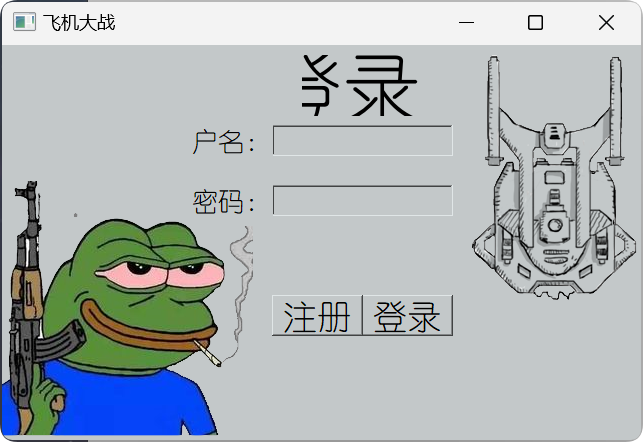

####  这个软件的由来说来话长。。。。

当初，我在qq群里看到一个聊天机器人，还挺有意思的，里面有养宠物，打劫之类的功能，我就想，我能不能用python自己做一个呢？  

说干就干，于是我用了我极其拙劣的代码技术，写出了**养宠物.py**最初的版本。**如下**  

<video src="../../image/passage2/1.mp4" controls="controls" width="auto" height="auto"></video>

很简单，而且在命令行里运行，我还没有来得及完善功能，感觉太丑了，想写个游戏的界面，于是我就跑去学习pygame了。。。。过了没多久，出现了我的**第一版pygame版本**，如下

功能很简单，就是一个狗，在屏幕上，按wasd可以控制狗的位置，不能跑出屏幕（这是后来修复的bug了。。）

然后，感觉，这么搞，也不是很好玩，我都能做游戏了，为什么不找个有意思的？

于是我就想起了小时候喜欢的飞机大战

上网上找了一套素材，就开始忙活了  

根据我《python编程：从入门到实践》中的教程，不一会就做出来一个**飞机大战，但是不是很好玩**（敌人不会动）

我做了两种子弹，普通子弹和激光，按键盘上的1，2就可以切换  

<video src="../../image/passage2/2.mp4" controls="controls" width="400" height="auto"></video>

然后又重构了代码，跟着项目一步一步完成，最后做了个新的  

加入了登陆界面，也就是现在我做的**飞机大战**   

<video src="C:\Users\娄卫健\Desktop\homepage-master\homepage-master\image\passage2\3.mp4"></video>

游戏会随机出现空投，可以增加子弹数量（上限为3，之后就吃空投会加生命值）但是我发现这游戏还是有点难。。玩不过，我做的游戏嘛，那不是为所欲为，所以我就给自己加了按住空格能连续发射子弹（像激光一样。。。）的功能，这就容易多了。但是后来准备做boss也没有实施。

这个是模块化编程的，我把实现不同功能的类给放到不同文件了，比如

- alien.py
- bullet.py
- main.py
- game.py
- settings.py

这也算是技术历练了吧。

文件太多了，源码就不放了