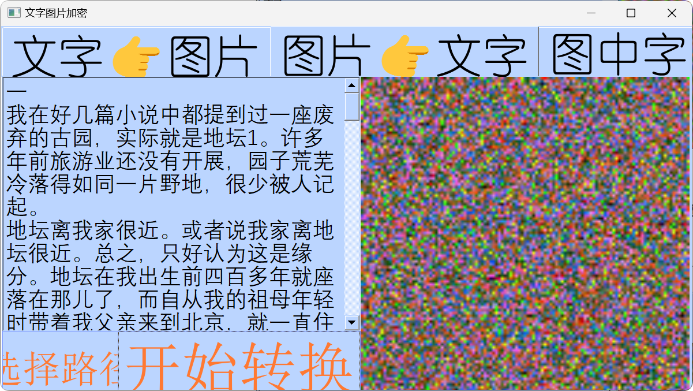

## 开发工具

- 集成开发环境：Pycharm
- Python
- Pyside2
- Pilow(PIL)

## 功能

1. **文本加密为图片**  

用户输入一段文字，程序将提取每个字符的 Unicode 序号，分别取出高位和低位，作为一个像素点的绿色（G）和蓝色（B）通道的值。随机生成红色（R）通道的值以增加随机性。最后，将这些像素点组合成一张图片，以达到加密的功能。  

2. **图片解密为文本**  

用户在图形化界面中选择一张加密后的图片，程序依次读取图片每个像素点的绿色（G）和蓝色（B）通道的值，分别作为高位和低位进行组合，再利用 chr() 函数得到该数字对应的字符。最后，将所有字符组合在一起还原为原始文本。

3. **图中字**  

用户输入图片和文字，软件生成一张图片，将原图片中每个像素点替换为用户输入的文字。  


## 如图


**我们再把生成的图片（文件会自动生成到该软件路径下的“保存的图片”文件夹）给还原一下试试**  





**可见，我们成功地从图片还原出了我与地坛的全文**  

接下来我们看看图中字功能


**这里我用我的微信头像（三叶）生成一下，生成的图片如下**  


**看起来还挺正常的，但是我们放大看，就能看到其实这张图片都是由“三叶”两个字组成的**  


**源码放了main.py，但是还有一个main.ui是我用qt designer做的，没有这个也没办法运行，也没有上传github（懒）如果想玩就加我qq吧：2141703630，（注释是AI帮我生成的，因为我现在看不懂我以前写的代码了）**

​     

```
from PySide2.QtWidgets import QApplication, QFileDialog, QMessageBox
from PySide2.QtUiTools import QUiLoader
from PIL import Image
import math
import random
from PySide2.QtGui import QPixmap, QIcon
from PySide2.QtCore import Qt, QThread, QMutex
import os
from PIL import Image, ImageDraw, ImageFont
import time

# 创建一个互斥锁对象qmut_1，用于在多线程环境下对共享资源的访问进行控制，
# 确保同一时间只有一个线程能够访问特定的资源，避免出现数据冲突等问题。
qmut_1 = QMutex()


class Worker2(QThread):
    """
    Worker2类继承自QThread，主要用于在单独的线程中处理图片加载及在界面上显示的相关操作。

    在多线程编程中，将这类耗时的操作放在单独线程执行，可防止阻塞主线程，
    使得程序的界面在图片加载过程中依然能够保持响应，提供更好的用户体验。

    Attributes:
        window: 与该线程相关联的窗口对象，通过它可以访问窗口中的各种属性和控件，
                以便在图片加载成功后能正确地将图片设置到对应的界面控件上进行显示。
    """
    def __init__(self, window):
        super(Worker2, self).__init__()
        self.window = window

    def run(self):
        """
        重写QThread类的run方法，此方法中的代码会在该线程启动时自动执行。

        该方法的主要任务是加载指定路径的图片，并将其设置到界面上特定的QLabel控件（lbnew）中显示。
        如果图片加载失败，会尝试多次重新加载。
        """
        qmut_1.lock()
        pic_path = "保存的图片/" + self.window.fill + ".png"
        pixmap = QPixmap(pic_path)
        if not pixmap.isNull():
            self.window.window.ui.lbnew.setPixmap(pixmap)
        else:
            print(f"无法加载图片: {pic_path}")

            # 当图片加载失败时，尝试进行多次重新加载操作。每次重新加载前等待0.1秒，
            # 这样做是为了给系统一些时间来处理可能的资源分配或其他相关问题，增加加载成功的几率。
            for _ in range(3):
                time.sleep(0.1)
                print(f"正在尝试重新加载图片: {pic_path}")
                pixmap = QPixmap(pic_path)
                if not pixmap.isNull():
                    self.window.window.ui.lbnew.setPixmap(pixmap)
                    break

            # 如果经过多次尝试后图片仍然无法加载成功，就弹出一个错误提示框告知用户加载失败的情况。
            if pixmap.isNull():
                QMessageBox.warning(self.window.window.ui, "错误", "无法加载图片。")
        qmut_1.unlock()


class Worker1(QThread):
    """
    Worker1类同样继承自QThread，主要负责在单独的线程中执行一系列复杂的图片处理操作。

    它会根据输入的文本内容以及源图像生成一张新的图片，处理完成后通过调用Worker2类的方法，
    将生成的图片显示在界面上。

    Attributes:
        window: 与该线程相关联的窗口对象，通过它可以获取窗口中的各种输入信息（如文本框内容），
                以及访问其他相关的控件和属性，以此来完成整个图片处理任务。
        fill: 要保存的图片文件名（不包含扩展名），该文件名是从窗口的相关文本框中获取的，
              用于指定生成图片的保存名称。
        worker: Worker2类的一个实例，用于在图片处理完成后，将处理好的图片在界面上进行显示操作。
    """
    def __init__(self, window):
        super(Worker1, self).__init__()
        self.window = window
        self.fill = self.window.ui.edt_name.text()
        self.worker = Worker2(self)

    def run(self):
        """
        重写QThread类的run方法，在这里定义了具体的图片处理逻辑流程。

        包括设置图片处理所需的一些参数（如子图尺寸、字体等），打开源图像，
        依据源图像的像素信息和输入的文本内容生成新的图片，最后保存图片并在界面上显示出来。
        """
        self.fill = self.window.ui.edt_name.text()

        # 定义子图的尺寸，这里将子图的宽度和高度都设置为16像素。
        # 在后续的图片处理过程中，会基于这个固定尺寸对源图像进行分割处理，
        # 以及在每个子图上进行文字绘制等相关操作。
        CHILD_W = CHILD_H = 16

        # 从窗口的相关文本框中获取要输出到图片中的文本内容，这个文本将会作为图片处理的一部分，
        # 例如可能会根据文本的字符依次绘制到图片的特定位置上。
        txt = self.window.ui.edt_fill.text()

        font_path = 'AliPuHui-Bold.ttf'
        font_size = CHILD_W
        try:
            font = ImageFont.truetype(font_path, font_size)
        except OSError:
            print(f"无法加载字体: {font_path}")
            font = ImageFont.load_default()
            # 如果无法加载指定的字体文件，就弹出一个警告提示框告知用户，
            # 同时告知用户程序将使用默认字体来继续后续的图片处理操作。
            QMessageBox.warning(self.window.window.ui, "警告", "无法加载指定字体，使用默认字体。")

        imgSrc_path = self.window.fileName[0]
        try:
            imgSrc = Image.open(imgSrc_path, "r")
        except FileNotFoundError:
            print(f"无法找到源图像: {imgSrc_path}")
            QMessageBox.warning(self.window.window.ui, "错误", "无法找到源图像。")
            return

        w, h = imgSrc.size

        imgChild = Image.new("RGB", (CHILD_W, CHILD_H))

        imgDst = Image.new("RGB", (CHILD_W * w, CHILD_H * h))

        textW, textH = font.getsize("迷")
        offsetX = (CHILD_W - textW) >> 1
        offsetY = (CHILD_H - textH) >> 1

        charIndex = 0
        draw = ImageDraw.Draw(imgChild)

        print("开始处理图片...")

        for y in range(h):
            for x in range(w):
                draw.rectangle((0, 0, CHILD_W, CHILD_H), fill='lightgray')

                if charIndex < len(txt):
                    draw.text((offsetX, offsetY), txt[charIndex], font=font, fill=imgSrc.getpixel((x, y)))
                else:
                    draw.text((offsetX, offsetY), " ", font=font, fill=imgSrc.getpixel((x, y)))

                imgDst.paste(imgChild, (x * CHILD_W, y * CHILD_H))

                charIndex += 1
                if charIndex == len(txt):
                    charIndex = 0

                print(str((x, y)))

        save_path = "保存的图片/" + self.fill + ".png"
        try:
            imgDst.save(save_path)
        except OSError:
            print(f"无法保存处理后的图片: {save_path}")
            QMessageBox.warning(self.window.window.ui, "错误", "无法保存处理后的图片。")

        self.worker.run()

        for _ in range(2):
            print(f"图片处理完成后的额外操作，第 {_ + 1} 次循环")
            time.sleep(0.1)

        time.sleep(0.2)


class Stats:
    """
    Stats类主要用于管理应用程序的主窗口界面以及与之相关的各种操作逻辑。

    它负责初始化窗口界面，将各个按钮的点击事件连接到对应的处理方法上，
    并且通过创建Worker1类的实例来执行图片处理相关的后台线程任务。

    Attributes:
        ui: 通过QUiLoader加载的主窗口界面对象，这个对象包含了各种各样用于显示和交互的控件，
            比如按钮、文本框、标签等。通过这些控件，用户可以与程序进行各种交互操作，
            例如输入信息、触发操作、查看结果等。
        fileName: 用于存储当前选择的文件名称或路径，在涉及文件操作（如打开、保存等）的方法中，
                会使用到这个变量来确定具体要操作的文件。
        worker1: Worker1类的一个实例，用于在后台线程中执行图片处理相关的任务，
                例如根据用户在界面上输入的内容生成新的图片，或者对已经选择的图片进行特定处理等。
    """
    def __init__(self):
        self.ui = QUiLoader().load('main.ui')
        self.ui.bt1.clicked.connect(self.do1)
        self.ui.bt2.clicked.connect(self.do2)
        self.ui.bt3.clicked.connect(self.do3)
        self.ui.bt_chose.clicked.connect(self.open_file)
        self.ui.bt_enter.clicked.connect(self.font_in_png)
        self.ui.lb1.setScaledContents(True)
        self.ui.lb2.setScaledContents(True)
        self.ui.lbnew.setScaledContents(True)
        self.fileName = ''
        self.worker1 = Worker1(self)

    def do1(self):
        """
        do1方法是与窗口中名为bt1的按钮点击事件相关联的处理方法。

        该方法的主要功能是将用户在界面的edit1文本框中输入的文本内容进行编码，
        并根据编码结果生成一张图片，然后将生成的图片保存到指定路径下，
        最后尝试在界面的特定QLabel控件（lb1）上显示该图片。
        如果图片显示失败，还会对图片进行一些额外的处理（如旋转）并再次尝试显示。
        """
        def encode():
            text = self.ui.edit1.toPlainText()
            str_len = len(text)
            width = math.ceil(str_len ** 0.5)
            im = Image.new("RGB", (width, width), 0x0)
            x, y = 0, 0

            for i in text:
                index = ord(i)
                r = random.randint(0, 255)
                g = (index & 0xFF00) >> 8
                b = index & 0xFF
                rgb = (r, g, b)
                im.putpixel((x, y), rgb)

                if x == width - 1:
                    x = 0
                    y += 1
                else:
                    x += 1

            return im

        im = encode()

        if not os.path.exists('保存的图片'):
            os.mkdir('保存的图片')

        save_path = "保存的图片/" + self.ui.name_edit.text() + ".bmp"
        try:
            im.save(save_path)
        except OSError:
            print(f"无法保存编码后的图片: {save_path}")
            QMessageBox.warning(self.ui, "错误", "无法保存编码后的图片。")

        pixmap = QPixmap(save_path)
        if not pixmap.isNull():
            self.ui.lb1.setPixmap(pixmap)
        else:
            print(f"无法加载编码后的图片: {save_path}")

            for _ in range(3):
                r = random.randint(0, 180)
                im = im.rotate(r)
                save_path = "保存的图片/" + self.ui.name_edit.text() + f"_rotated_{r}.bmp"
                try:
                    im.save(save_path)
                    pixmap = QPixmap(save_path)
                    if not pixmap.isNull():
                        self.ui.lb1.setPixmap(pixmap)
                        break
                except OSError:
                    print(f"无法保存旋转后的图片: {save_path}")
                if pixmap.isNull():
                    QMessageBox.warning(self.ui, "错误", "无法加载编码后的图片，且多次尝试旋转后仍无法加载。")

    def do2(self):
        """
        do2方法是与窗口中名为bt2的按钮点击事件相关联的处理方法。

        该方法主要实现了通过文件对话框让用户选择一张图片的功能，
        并将用户选择的图片在界面的特定QLabel控件（lb2）上进行显示。
        如果图片加载失败，会弹出一个错误提示框告知用户加载失败的情况。
        此外，还会对选择的图片文件名进行一些额外的处理（如创建一个新文件并写入相关内容），
        虽然这些额外处理可能在实际应用中的作用不是特别大，但可以作为一种示例展示相关操作。
        """
        self.fileName = QFileDialog.getOpenFileName(self.ui, r'选择要转换的图片', '保存的图片/', '图像文件(*.jpg *.bmp *.png)')

        pixmap = QPixmap(self.fileName[0])
        if not pixmap.isNull():
            self.ui.lb2.setPixmap(pixmap)
        else:
            print(f"无法加载选择的图片: {self.fileName[0]}")
            QMessageBox.warning(self.ui, "错误", "无法加载选择的图片。")

        file_name = self.fileName[0]
        file_name_parts = file_name.split('.')
        new_file_name = file_name_parts[0] + "_modified." + file_name_parts[1]
        try:
            with open(new_file_name, 'w') as f:
                f.write("这是对选择图片文件名的额外处理内容，可能没什么实际作用\n")
        except OSError:
            print(f"无法创建或写入新文件: {new_file_name}")
            QMessageBox.warning(self.ui, "错误", "无法创建或写入新文件。")

    def do3(self):
        """
        do3方法是与窗口中名为bt3的按钮点击事件相关联的处理方法。

        该方法主要实现了对之前通过文件对话框选择的一张图片进行解码操作的功能，
        它会将图片中的像素信息还原为文本内容，并将解码后的文本显示在界面的特定文本框（edit2）中。
        此外，还会对解码后的文本进行一些简单的变换（如反转字符串）后再进行显示，
        这可能是为了展示对解码结果的进一步处理或者满足某种特定的需求。
        """
        def decode():
            im_path = self.fileName[0]
            try:
                im = Image.open(im_path, "r")
            except FileNotFoundError:
                print(f"无法找到要解码的图片: {im_path}")
                QMessageBox.warning(self.ui, "错误", "无法找到要解码的图片。")
                return

            width, height = im.size
            lst = []
            out = ''

            for y in range(height):
                for x in range(width):
                    red, green, blue = im.getpixel((x, y))
                    if (blue | green | red) == 0:
                        break
                    index = (green << 8) + blue
                    lst.append(chr(index))

            for i in lst:
                out += i

            return out

        all_text = decode()

        self.ui.edit2.setPlainText(all_text)

        all_text = all_text[::-1]
        self.ui.edit2.setPlainText(all_text)

    def font_in_png(self):
        """
        font_in_png方法是与窗口中名为bt_enter的按钮点击事件相关联的处理方法。

        该方法的主要作用是启动Worker1线程来执行图片处理相关的任务，
        具体的图片处理操作在Worker1类的run方法中已经详细定义。
        """
        self.worker1.run()

    def open_file(self):
        """
        open_file方法是与窗口中名为bt_chose的按钮点击事件相关联的处理方法。

        该方法主要实现了通过文件对话框让用户选择一张要转换的图片的功能，
        并将用户选择的文件名称或路径存储在fileName变量中，以便后续的图片处理操作能够使用到该信息。
        """
        self.fileName = QFileDialog.getOpenFileName(self.ui, r'选择要转换的图片', '保存的图片/', '图像文件(*.jpg *.bmp *.png)')


def main():
    app = QApplication([])
    app.setWindowIcon(QIcon('logo.png'))
    stats = Stats()
    stats.ui.show()
    app.exec_()


if __name__ == '__main__':
    main()
```


